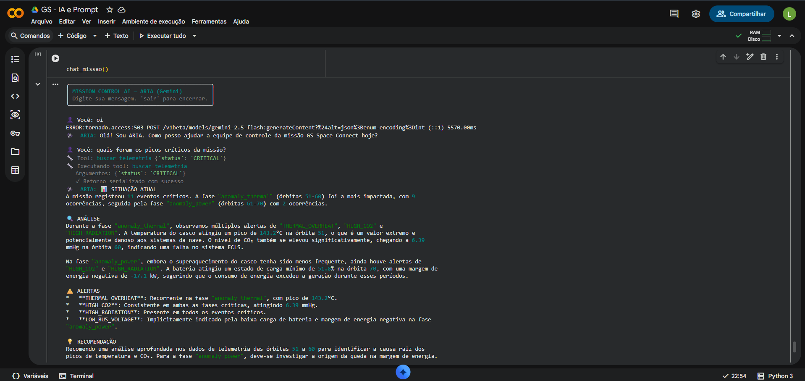
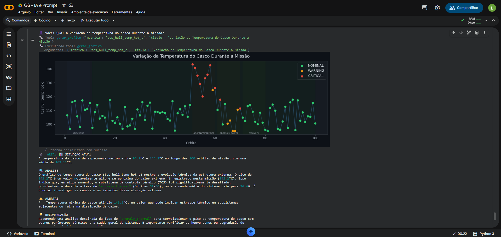

# ARIA(AUTONOMOUS RESPONSE & INTELLIGENCE ANALYST)

Lana Namie Kano Ozeki - RM 569795 
Luigi Borgheti Freire - RM 569958 
Raphael Chen Rue Tien - RM 570261

## Resumo do Projeto ARIA:

ARIA (Autonomous Response & Intelligence Analyst) é um chatbot de controle de missão espacial que conecta o Gemini a um banco de telemetria real no Supabase, contendo 100 órbitas simuladas com dados de energia, temperatura, comunicação e suporte à vida. Via tool calling, a IA busca dados, gera gráficos e monta dashboards automaticamente, respondendo em linguagem natural com análises operacionais e alertas críticos da missão.

 ## Demonstração

